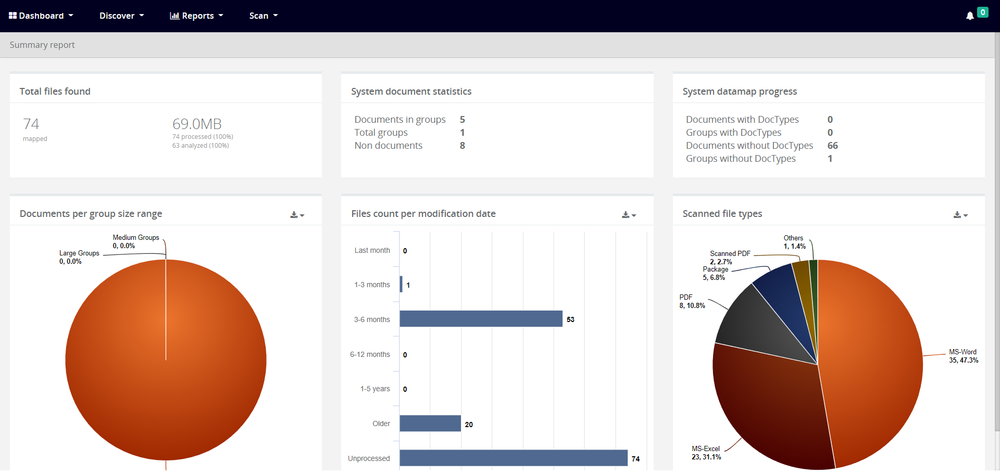
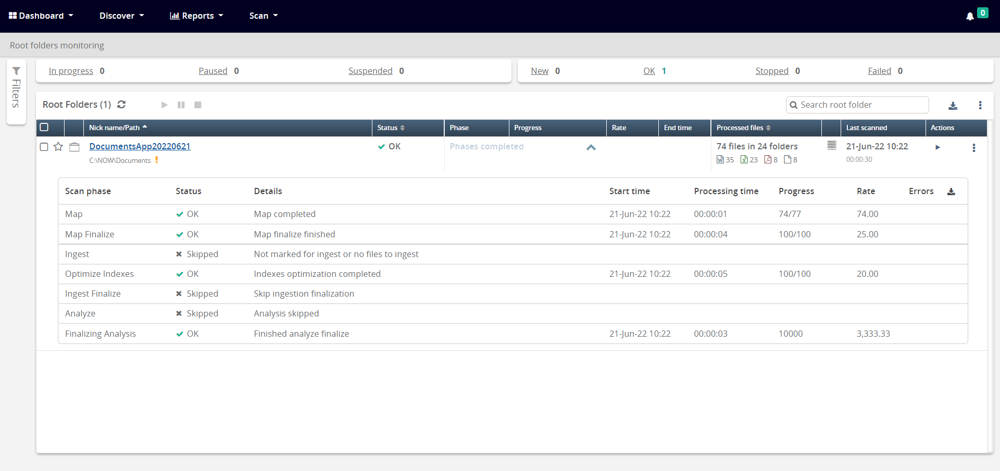
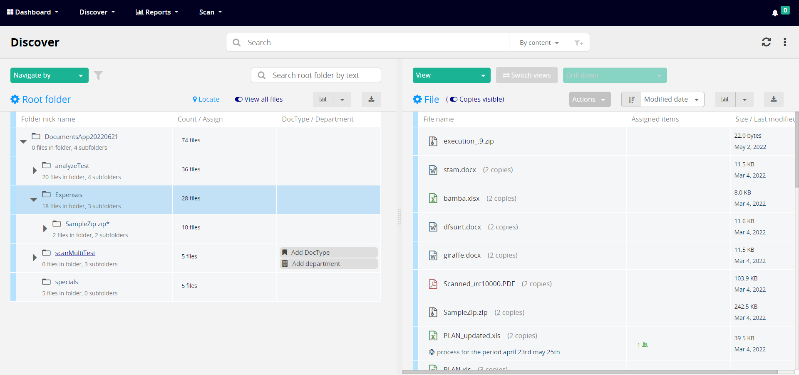
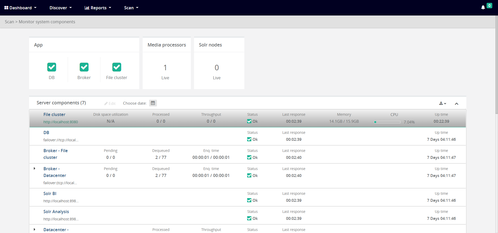
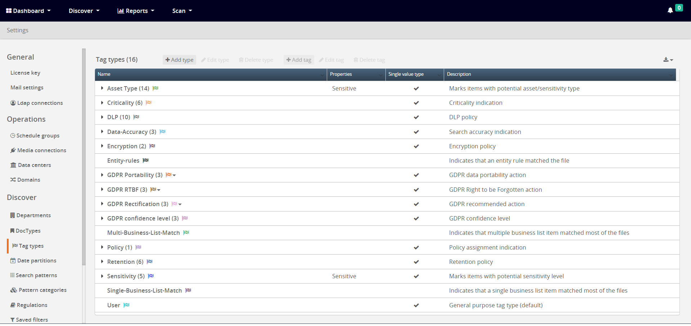

# Document Authority

An automatic document classification platform that automatically catalogue unstructured files and documents according to their business functionality to define what it contains, where it resides and who has access to it, allowing to create a consistent and rigorous approach to managing unstructured data across the enterprise.

 # Architecture Overview

- Dashboard Module
- Scan Module
- Discover Module
- AngularJS Modules
- Settings Module

## Dashboard Module

- System Dashboard
- IT Dashboard
- Dashboard List

## Scan Module

- Active scans
- Schedule groups
- Scan history

## Discover Module

- File groups
- Discover UI of Root Folder

## AngularJS Modules

- Root folders
- System components

## Settings Module

- Media connections
- Ldap connections

